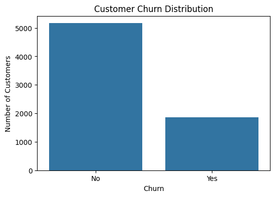
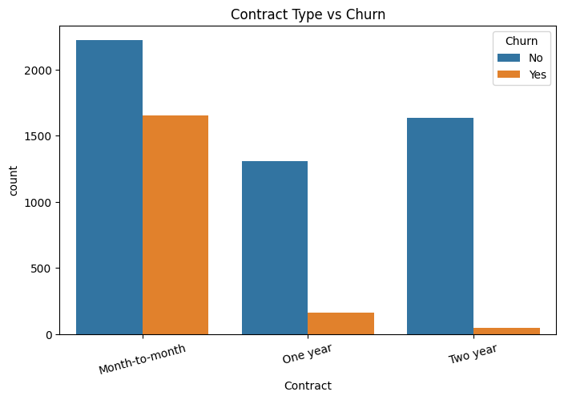
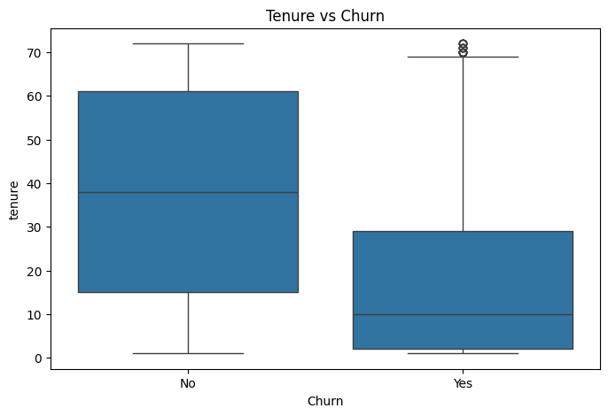
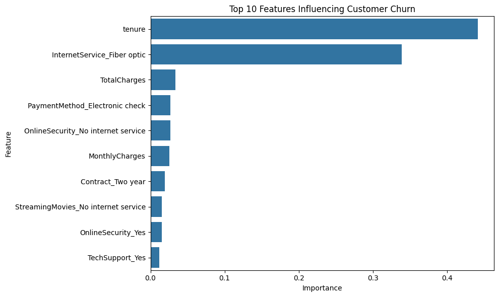
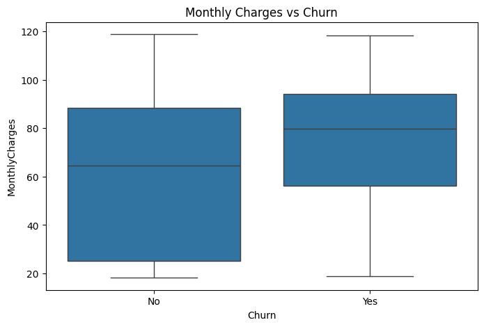

# 📊 Customer Churn Prediction Using Machine Learning

## Overview

Customer churn is one of the most significant challenges faced by subscription-based businesses. Acquiring new customers is often more expensive than retaining existing ones, making churn prediction an important business problem.

This project develops a machine learning framework to predict customer churn using demographic, service usage, contract, and billing information from a telecommunications company. The objective is to identify customers who are likely to leave and uncover the key factors influencing customer retention.

---

## Business Problem

Customer churn occurs when a customer stops using a company's services.

The ability to predict churn enables organizations to:

- Identify high-risk customers
- Improve customer retention strategies
- Reduce revenue loss
- Increase customer lifetime value
- Target retention campaigns more effectively

---

## Dataset

**Dataset:** IBM Telco Customer Churn Dataset

### Dataset Summary

- Total Customers: 7,032
- Features: 20
- Target Variable: Churn

### Key Features

- Gender
- Senior Citizen Status
- Partner
- Dependents
- Tenure
- Internet Service
- Contract Type
- Payment Method
- Monthly Charges
- Total Charges

---

## Technologies Used

- Python
- Pandas
- NumPy
- Matplotlib
- Seaborn
- Scikit-learn
- Google Colab
- Jupyter Notebook

---

## Methodology

### 1. Data Cleaning

- Missing value identification and handling
- Conversion of TotalCharges to numeric format
- Removal of customer identifiers
- Binary encoding of the target variable
- Data quality verification

### 2. Exploratory Data Analysis

Visualizations were created to examine:

- Customer churn distribution
- Contract type vs churn
- Customer tenure vs churn
- Monthly charges vs churn

### 3. Feature Engineering

Categorical variables were transformed using one-hot encoding to prepare the dataset for machine learning models.

### 4. Machine Learning Models

Two classification algorithms were developed:

- Logistic Regression
- Decision Tree Classifier

---

## Model Performance

### Logistic Regression

| Metric | Score |
|---|---:|
| Accuracy | 80.4% |
| Precision | 65% |
| Recall | 57% |
| F1-Score | 61% |
| ROC-AUC | 0.836 |

### Decision Tree

| Metric | Score |
|---|---:|
| Accuracy | 77.8% |
| Precision | 58% |
| Recall | 60% |
| F1-Score | 59% |

### Best Performing Model

Logistic Regression achieved the strongest overall performance, providing the best balance between precision and recall while maintaining the highest accuracy and F1-score.

---

## Results

### Customer Churn Distribution

The dataset shows that approximately 27% of customers churned while 73% remained with the company.

---

### Contract Type vs Churn

Customers on month-to-month contracts exhibited substantially higher churn rates than customers on one-year and two-year contracts.

---

### Tenure vs Churn

Customer tenure emerged as one of the strongest indicators of churn. Customers who remained with the company generally had significantly longer tenures than customers who churned.

---

### Feature Importance

Feature importance analysis identified the primary drivers of customer churn.

Key predictive factors included:

- Customer Tenure
- Internet Service Type
- Total Charges
- Monthly Charges
- Contract Type
- Payment Method

---

### Monthly Charges vs Churn

Customers with higher monthly charges demonstrated a greater tendency to leave the company.

---

## Key Findings

### High-Risk Customers

- Customers with short tenure
- Customers on month-to-month contracts
- Customers with higher monthly charges
- Customers using electronic check payment methods
- Certain internet service subscribers

### Lower-Risk Customers

- Long-term customers
- Customers on two-year contracts
- Customers with additional support services
- Customers with lower monthly costs

---

## Business Recommendations

Based on the findings, organizations should consider:

- Offering incentives for long-term contracts
- Improving onboarding experiences for new customers
- Providing targeted retention offers to high-risk customers
- Reviewing pricing strategies for customers with high monthly charges
- Monitoring customers with identified churn risk characteristics

---

## Future Improvements

Potential future enhancements include:

- Random Forest and Gradient Boosting models
- Hyperparameter optimization
- Ensemble learning approaches
- Customer segmentation analysis
- Real-time churn prediction dashboards
- Integration with business intelligence tools such as Power BI

---

## Author

**Mirza Gohar Baig Barlas**
